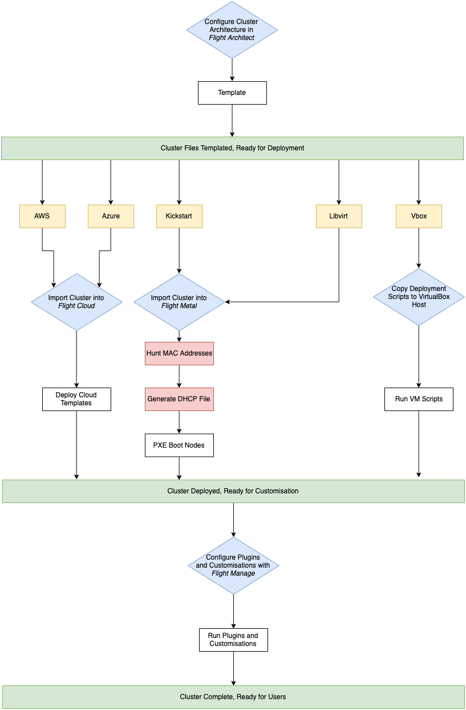

.. _workflow-considerations:

Workflow Considerations: General
================================

What is a Workflow?
-------------------

A workflow, in the context of this documentation, regards the general cluster architecture in terms of the :ref:`network and hardware design <cluster-architectures>` for the workload of the end-user. For example:

- **Scheduler Cluster:** A scheduler cluster can be considered the "standard" cluster architecture design. Usually consisting of a login node from which users submit jobs to collections of compute nodes.
- **Container Workload:** A cluster for container workloads would most likely consist of a collection of compute nodes running a container software (e.g. Docker, Kubernetes, LXC).
- **Embarrassingly Parallel:** Jobs which are considered `Embarrassingly Parallel <https://en.wikipedia.org/wiki/Embarrassingly_parallel>`_ don't often require complex scheduler configurations but inside rely on a lot of available resources for firing jobs at.

openflightHPC Generalised Workflow
----------------------------------

The openflightHPC tools are designed such that each tool can export/import relevant data from the other tools. 

Below is the general outline of the process from one tool to another in order to deploy a cluster. 

Despite the paths fork during platform deployment, the process is pretty straightforward regardless of what workflow is being used.
